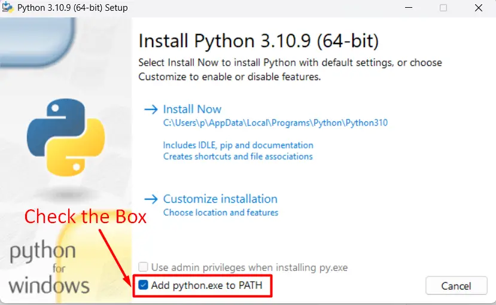

# Занятие 1. Введение. Установка ПО. Git.

1. [Установка ПО](#установка-по)
    1. [Установка ПО. Python](#установка-по-python-311)
    2. [Установка ПО. Git](#установка-по-git)
    3. [Установка ПО. IDE](#установка-по-vs-code--pycharm)
    4. [Установка ПО. Jupyter Lab nbgrader](#установка-по-jupyter-lab-nbgrader)
2. [GIT](#git)
    1. [Git. Основные команды](#git-d0bed181d0bdd0bed0b2d0bdd18bd0b5-d0bad0bed0bcd0b0d0bdd0b4d18b-1)
    2. [Git. Настройка SSH](#git-d0bdd0b0d181d182d180d0bed0b9d0bad0b0-ssh-1)
    3. 

## Установка ПО

Для занятий потребуется следующий набор программ и инструментов:
* Python 3.11
* Git
* IDE (VS Code / PyCharm)
* Jupyter Lab
* nbgrader

---

### Установка ПО. Python 3.11

#### Любая ОС

Скачать требуемую версию по ссылке: [Python](https://www.python.org/downloads/release/python-3121/) и установить.

Во время установки необходимо поставить галочку **Add python.exe to PATH**:



#### Linux (Ubuntu)

В терминале выполнить:

```sh
sudo apt install python3.12
```

Для других дистрибутивов необходимо использовать их менеджеры пакетов.

### Установка ПО. Python 3.11

### Установка ПО. Git

### Установка ПО. IDE (VS Code / PyCharm)

### Установка ПО. Jupyter Lab, nbgrader

## Git

### Git. Основные команды

### Git. Настройка SSH